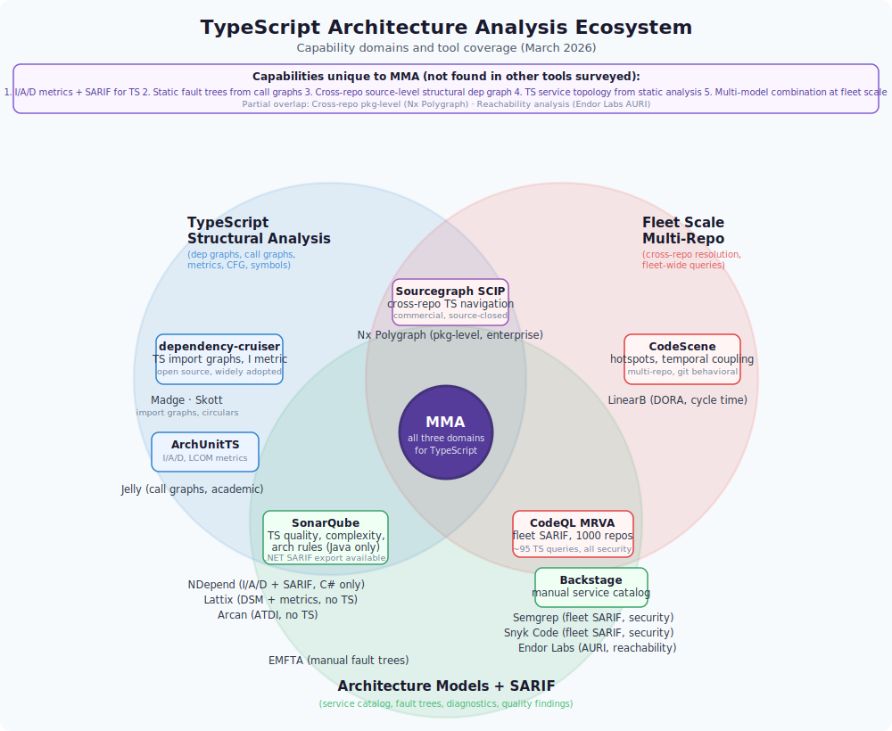

[](https://www.npmjs.com/package/multi-model-analyzer)
[](https://github.com/john-wilmes/multi-model-analyzer/actions/workflows/ci.yml)
[](LICENSE)
[](https://nodejs.org/)

# Multi-Model Analyzer (mma)

> ⚠️ **Status: Beta** — APIs and output formats may change between releases.

## Contents
- [What It Finds](#what-it-finds)
- [Key Features](#key-features)
- [Quick Start](#quick-start)
- [Commands](#commands)
- [Examples](#examples)
- [How It Works](#how-it-works)
- [Architecture](#architecture)
- [Prerequisites](#prerequisites)
- [Data Handling](#data-handling)
- [Findings Reference](#findings-reference)
- [Contributing](#contributing)
- [Getting Started Guide](#getting-started-guide)
- [License](#license)

Static analysis toolchain for TypeScript monorepos. Index hundreds of repos, surface structural debt, fault risks, and cross-repo coupling -- then explore results in a web dashboard, share baselines with your team, or plug into your IDE via MCP. No cloud API required.

<p align="center">
  
</p>

```text
$ mma index -c supabase.config.json
[1/10] supabase-js  [2/10] gotrue-js  ...  [10/10] supabase
Indexed 10 repos: 7,775 modules, 214,850 edges, 4,488 findings (118s)

$ mma practices
Practices Report — Grade: F (0/100) — 10 repo(s)

ATDI: 85.1/100 (stable) — 4,488 findings across 10 repos

Category Scorecard:
Category      Health  Errors  Warnings  Notes  Total
------------  ------  ------  --------  -----  -----
fault         ★★☆☆☆   0       218       938    1156
structural    ★☆☆☆☆   0       81        2846   2927
hotspot       ★★★☆☆   0       0         121    121
blast-radius  ★★★★★   0       0         93     93

Top Findings:
Rule                                Category    Level    Count
----------------------------------  ----------  -------  -----
structural/dead-export              structural  note     2315
fault/missing-error-boundary        fault       note     938
structural/pain-zone-module         structural  note     485
fault/unhandled-error-path          fault       warning  218
hotspot/high-churn-complexity       hotspot     note     121
```

That output is real — [Supabase](https://github.com/supabase) ecosystem (10 repos, 7,775 modules, 215k edges).

## What It Finds

| Category | What | Example |
|----------|------|---------|
| **Structural** | Unstable dependencies, dead exports, pain zone modules | "Module A (stable) depends on module B (unstable) -- inverted dependency direction" |
| **Fault** | Unhandled error paths, silent catch blocks, missing re-throws | "Catch block in `handler` has no logging or re-throw" |
| **Blast radius** | High-PageRank modules where changes ripple widely | "Changes to this file affect many dependents" |

All findings are SARIF v2.1.0 with logical locations only -- no source code leaves your machine.

## Key Features

- Cross-repo analysis across multiple TypeScript repositories, with symbol-level resolution (98% coverage on real-world monorepo ecosystems)
- SARIF v2.1.0 output with built-in anonymization for safe sharing
- MCP server with 26 tools for IDE/agent integration (`mma serve`) — stdio or HTTP transport
- Web dashboard with dependency graphs, blast radius, and service catalog views
- 3-tier summarization (2 free local tiers + optional LLM tier via Ollama, Anthropic, or OpenAI)
- Design pattern detection (adapter, facade, observer, factory, singleton, repository, middleware, decorator)
- Baseline sharing for incremental reindexing across teams — see [docs/baseline-sharing.md](docs/baseline-sharing.md)
- Pluggable storage backends: SQLite (default) and Kuzu graph DB (`--backend kuzu`)
- No cloud API required — everything runs locally by default; cloud LLM providers are optional

### Dashboard

The web dashboard provides 10 views — Overview, Findings, Cross-Repo (Graph, Feature Flags, Cascading Faults, Service Catalog), Temporal Coupling, Hotspots, Design Patterns, Blast Radius, Repo Detail, Module Detail, and Dependency Graph — served via 15 API endpoints. Launch it with `mma dashboard` (default port 3000).

## Quick Start

```bash
npm install -g multi-model-analyzer

# Create a config pointing at your repos
cat > mma.config.json << 'EOF'
{
  "mirrorDir": "./mirrors",
  "outputDb": "./mma.db",
  "repos": [
    { "url": "https://github.com/supabase/supabase-js.git", "branch": "main" },
    { "url": "https://github.com/supabase/ssr.git", "branch": "main" }
  ]
}
EOF

# Index and analyze
mma index -c mma.config.json -v
mma practices
mma dashboard
```

Or skip indexing entirely -- download the [prebuilt Supabase baseline](https://github.com/john-wilmes/multi-model-analyzer/releases/latest) (10 repos, 20 MB compressed) and explore immediately:

```bash
gunzip supabase-ecosystem-baseline.db.gz
mma import supabase-ecosystem-baseline.db
mma dashboard
```

See [docs/getting-started.md](docs/getting-started.md) for a full walkthrough.

## Commands

After `npm install -g multi-model-analyzer`, all commands are available as `mma <command>`.

```text
mma index            Index repositories (clone, parse, analyze)
mma practices        Health report with prioritized findings and grades
mma query            Natural language queries ("what calls auth?", "dependencies of scheduler")
mma report           Anonymized field trial report (JSON, markdown, SARIF)
mma export           Export SQLite DB (anonymized by default, --raw for baseline sharing)
mma import           Import a raw baseline export into local DB
mma merge            Combine multiple anonymized export DBs
mma validate         Statistical validation of SARIF findings quality
mma affected         Blast radius for a rev range
mma serve            MCP server for IDE integration (stdio default, --transport http on port 3001)
mma baseline create  Snapshot findings as known-violations baseline
mma baseline check   Check for new violations against baseline (exit 1 if found)
mma delta            Show diff of findings between two runs
mma catalog          Inspect the inferred service catalog
mma dashboard        Launch the web dashboard UI (port 3000)
mma compress         Compress/prune the SQLite DB to reduce disk usage
mma audit            Parse npm audit JSON and check vulnerability reachability
mma enrich           Standalone LLM enrichment (Tier 3 summaries via Ollama)
mma explore          Interactive incremental indexing with guided repo discovery
mma index-org        Scan a GitHub org and index all matching repos in batches
```

Key flags that apply across commands:

```text
--backend kuzu      Use Kuzu graph DB instead of SQLite (applies to index, serve, explore, and others)
--transport http    Use HTTP transport for MCP server instead of stdio (applies to serve, default port 3001)
--enrich            Enable LLM enrichment (Tier 3) during indexing
--ollama-url URL    Ollama endpoint (default: http://localhost:11434)
--ollama-model M    Ollama model (default: qwen2.5-coder:1.5b)
--llm-provider P    LLM backend: ollama (default), anthropic, or openai
--llm-api-key KEY   API key for cloud LLM (or set ANTHROPIC_API_KEY / OPENAI_API_KEY)
--llm-model M       Override model name (default: claude-haiku-4-5-20251001 / gpt-4o-mini)
```

## Examples

### Prioritized Practices Report

The `practices` command partitions findings into action tiers:

- **Fix Now** -- warnings and errors that indicate active risk
- **Plan For** -- notes worth addressing in the next cycle
- **Monitor** -- low-priority items to track over time

Each finding includes a concrete action:

```json
{
  "ruleId": "structural/unstable-dependency",
  "count": 64,
  "level": "warning",
  "interpretation": "A stable module depends on an unstable one, inverting the expected dependency direction.",
  "action": "Introduce an abstraction layer or inversion-of-control boundary to isolate the unstable module."
}
```

Output formats: `--format table` (default), `json`, `markdown`.

### Anonymized SARIF

When sharing results externally, use `--salt` to redact identifiers:

```json
{
  "ruleId": "fault/unhandled-error-path",
  "level": "warning",
  "message": {
    "text": "Catch block in [REDACTED:b1861bbf]#handler has no logging or re-throw"
  },
  "locations": [{
    "logicalLocations": [{
      "name": "[REDACTED:ad0b9153]",
      "kind": "module",
      "properties": { "repo": "[REDACTED:527d4d8a]" }
    }]
  }]
}
```

No source code, no file paths, no service names -- just the structural finding.

## How It Works

Index-heavy, query-cheap. All analysis runs at index time; queries are lookups and graph traversals.

```text
Repos --> Ingestion --> Parsing --> Structural Analysis --> Heuristic Analysis
                                                               |
                                          Summarization (tiers 1-3) --> Storage
                                                               |
                              Config Model / Fault Model / Functional Model
                                                               |
                                                      SARIF Diagnostics
```

**Parsing** uses [tree-sitter](https://tree-sitter.github.io/tree-sitter/) (WASM) for fast syntax-only parsing, with optional [ts-morph](https://ts-morph.com/) for type-resolved symbols.

**Summarization** has 3 tiers -- the first 2 are free and deterministic; tier 3 uses an LLM:

| Tier | Source | Cost | Example |
|------|--------|------|---------|
| 1 | Templates from AST | Free | "Accepts (patientId: string), returns Promise" |
| 2 | Heuristics from naming | Free | "Fetches appointments for a patient" |
| 3 | LLM (Ollama/Anthropic/OpenAI) | Free or API cost | "Queries appointment table, maps results, handles pagination" |

### LLM Enrichment (Tier 3)

Tiers 1 and 2 are deterministic (no LLM). Tier 3 upgrades low-confidence summaries using an LLM.

**Local (Ollama — default):**

```bash
mma index -c config.json --enrich
# Requires Ollama running locally (http://localhost:11434)
# Default model: qwen2.5-coder:1.5b
```

**Cloud (Anthropic / OpenAI):**

```bash
# Via environment variable (recommended):
export ANTHROPIC_API_KEY=sk-ant-...
mma index -c config.json --enrich --llm-provider anthropic

# Via CLI flag:
mma index -c config.json --enrich --llm-provider openai --llm-api-key sk-...

# Custom model:
mma index -c config.json --enrich --llm-provider anthropic --llm-model claude-sonnet-4-5-20250514
```

**Via config file (`mma.config.json`):**

```json
{
  "mirrorDir": "./mirrors",
  "llmProvider": "anthropic",
  "llmModel": "claude-haiku-4-5-20251001",
  "repos": [...]
}
```

Set `ANTHROPIC_API_KEY` or `OPENAI_API_KEY` as an environment variable — do not put API keys in the config file.

### GitHub Org Indexing

Use `mma index-org` to scan an entire GitHub org and index all TypeScript/JavaScript repos in batches:

```bash
# Scan and index the supabase org
mma index-org supabase -c mma.config.json --enrich --llm-provider anthropic

# With options:
mma index-org my-org --concurrency 8 --batch-size 20 --language TypeScript,JavaScript
```

Flags:
- `--concurrency N` — parallel repos per batch (default: 4)
- `--batch-size N` — repos per batch before persisting (default: 20)
- `--language` — comma-separated list of GitHub language filters (default: TypeScript,JavaScript)
- `--force-full-reindex` — clear and rebuild graph for each repo
- All `--enrich`, `--llm-provider`, `--llm-api-key`, `--llm-model` flags apply

## Architecture

Monorepo with npm workspaces:

| Package | Purpose |
|---------|---------|
| `packages/core` | Shared types, SARIF schema |
| `packages/ingestion` | Git clone/fetch, change detection, file classification |
| `packages/parsing` | AST parsing (tree-sitter WASM + ts-morph) |
| `packages/structural` | Call graphs, dependency graphs, control flow graphs |
| `packages/heuristics` | Service inference, pattern detection, feature flags, log mining |
| `packages/summarization` | 3-tier description generation |
| `packages/storage` | Graph DB, search (FTS5/BM25), KV store (SQLite) |
| `packages/storage-kuzu` | Graph DB backend (Kuzu, optional) |
| `packages/correlation` | Cross-repo service correlation |
| `packages/models/*` | Config model, fault model, functional model |
| `packages/diagnostics` | SARIF emission, redaction, aggregation |
| `packages/query` | Natural language query routing |
| `packages/mcp` | MCP server for IDE integration |
| `apps/cli` | CLI entry point |
| `apps/dashboard` | Web dashboard (React 19, Recharts, Cytoscape) |

## Prerequisites

- Node.js 22+
- macOS, Linux, or Windows (WSL2)

Optional:
- [Ollama](https://ollama.com/) for tier-3 LLM summarization (free, runs locally)
- Anthropic or OpenAI API key for cloud-based tier-3 summarization at scale (see `--llm-provider`)

## Data Handling

- Repos are cloned as bare mirrors (no working tree checkout)
- All analysis is local -- in-memory or SQLite
- Output uses logical locations only (no source snippets)
- Built-in redaction hashes all identifiers before sharing
- No telemetry

## Findings Reference

See [docs/findings-guide.md](docs/findings-guide.md) for all SARIF rule IDs, severity levels, and metrics.

## Contributing

See [CONTRIBUTING.md](CONTRIBUTING.md) for development setup and guidelines.

## Getting Started Guide

For a detailed 15-minute walkthrough (install, index, explore, share), see [docs/getting-started.md](docs/getting-started.md).

## License

[MIT](LICENSE)
